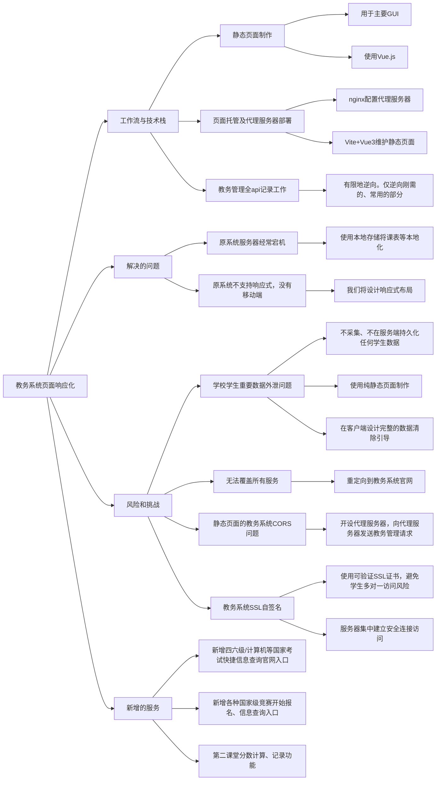

# 月宫の教务系统PROJECT

```mermaid
graph LR
    A[教务系统页面响应化] --> B[工作流与技术栈]
    A --> C[解决的问题]
    A --> D[风险和挑战]
    A --> E[新增的服务]
    
    B --> B1[静态页面制作]
    B --> B2[页面托管及代理服务器部署]
    B --> B3[教务管理全api记录工作]
    
    B1 --> B11[用于主要GUI]
    B1 --> B12[使用Vue.js]
    B2 --> B21[nginx配置代理服务器]
    B2 --> B22[Vite+Vue3维护静态页面]
    B3 --> B31[有限地逆向。仅逆向刚需的、常用的部分]
    
    C --> C1[原系统服务器经常宕机]
    C --> C2[原系统不支持响应式，没有移动端]
    
    C1 --> C11[使用本地存储将课表等本地化]
    C2 --> C21[我们将设计响应式布局]
    
    D --> D1[学校学生重要数据外泄问题]
    D --> D2[无法覆盖所有服务]
    D --> D3[静态页面的教务系统CORS问题]
    D --> D4[教务系统SSL自签名]
    
    D1 --> D11[不采集、不在服务端持久化任何学生数据]
    D1 --> D12[使用纯静态页面制作]
    D1 --> D13[在客户端设计完整的数据清除引导]
    D2 --> D21[重定向到教务系统官网]
    D3 --> D31[开设代理服务器，向代理服务器发送教务管理请求]
    D4 --> D41[使用可验证SSL证书，避免学生多对一访问风险]
    D4 --> D42[服务器集中建立安全连接访问]
    
    E --> E1[新增四六级/计算机等国家考试快捷信息查询官网入口]
    E --> E2[新增各种国家级竞赛开始报名、信息查询入口]
    E --> E3[第二课堂分数计算、记录功能]
```